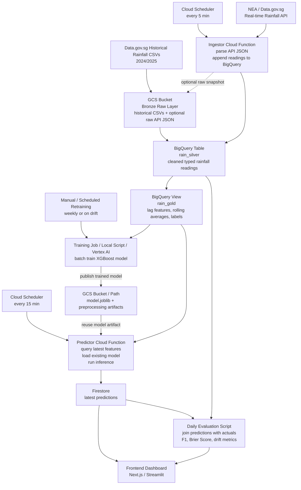

# MLOps Project Implementation Plan: Singapore Rain Nowcasting

This project architected a professional-grade MLOps pipeline on Google Cloud Platform (GCP) to predict rainfall in Singapore with a 1-hour look-ahead window. It prioritizes data orchestration and automated delivery over model complexity.

## 1. System Architecture
The system follows a **Serverless Medallion Architecture**, ensuring clear separation between raw data, structured storage, and feature engineering.

* **Bronze Layer (Raw):** Historical CSVs and raw API JSON snapshots stored in **Google Cloud Storage (GCS)**.
* **Silver Layer (Structured):** Cleaned, deduplicated, and typed data stored in **BigQuery**.
* **Gold Layer (Features):** A BigQuery View that calculates time-series lags and rolling averages (acting as a lightweight Feature Store).
* **Serving Layer:** **Firestore** for low-latency frontend access to the latest predictions.

---

## 2. Detailed Implementation Steps

### Phase 1: Data Foundations & Historical Baselining
* **Bulk Ingestion:** Download historical rainfall CSVs (2024/2025) from Data.gov.sg and upload to GCS.
* **Warehouse Setup:** Load CSVs into a partitioned BigQuery table (`rain_silver`).
* **Feature Engineering (SQL):** Create a BigQuery View (`rain_gold`) using Window Functions:
    * `LAG(value, 12) OVER(...)` to create 1-hour historical lags.
    * `AVG(value) OVER(...)` for rolling trends.
    * Define the Target ($y$) by looking forward in time: `LEAD(value, 12)`.

### Phase 2: Continuous Ingestion Pipeline
* **Ingestor Cloud Function:** A Python-based function that calls the NEA Real-time Rainfall API.
* **Data Contract:** Map the incoming API JSON structure to the BigQuery Silver schema.
* **Stream Loading:** Use the BigQuery Client library to append new 5-minute snapshots into the Silver table.

### Phase 3: Model Training & Serialization
* **Batch Export:** Pull a training subset from the `rain_gold` view.
* **Training:** Fit an **XGBoost Classifier** to predict the binary "Rain in next 60m" event.
* **Serialization:** Export the model and any scalers as `model.joblib` and upload to GCS.

### Phase 4: Automated Inference Loop
* **Predictor Cloud Function:** 1.  Triggered every 15 minutes via **Cloud Scheduler**.
    2.  Queries the most recent row from the BigQuery Gold View.
    3.  Downloads the model from GCS.
    4.  Runs inference and writes the `rain_probability` to **Firestore**.

### Phase 5: Monitoring & Evaluation
* **Dashboard:** A Next.js/Streamlit frontend that reads from Firestore for "Live" risk reporting.
* **Feedback Loop:** A daily script that joins the `Predictions` (Firestore) with the `Actuals` (BigQuery) to calculate drift and accuracy metrics (F1-Score, Brier Score).

---

## 3. Success Metrics & MLOps KPIs

| Component | Metric | Target |
| :--- | :--- | :--- |
| **Data Freshness** | API-to-Warehouse Latency | < 3 minutes |
| **Automation** | Scheduler Uptime | 100% (96 runs/day) |
| **Model Quality** | Recall (Rain Events) | > 0.70 |
| **Cost Efficiency** | Daily GCP Burn | < $0.50 (Serverless) |

## 4. Key Gaps & Mitigations
* **Missing Data:** If sensors fail, SQL `LAG` functions may return nulls. 
    * *Mitigation:* Use `LAST_VALUE(value IGNORE NULLS)` in BigQuery to maintain feature continuity.
* **Class Imbalance:** It rarely rains, making models biased toward "Dry."
    * *Mitigation:* Apply `scale_pos_weight` in XGBoost to penalize missed rain events during training.

---
**Status:** 
Architecture Design Complete. Ready for Phase 1.

**References:** 
- Historical: https://data.gov.sg/collections/2279/view
- Real-time: https://data.gov.sg/datasets/d_6580738cdd7db79374ed3152159fbd69/view#tag/default/GET/rainfall
